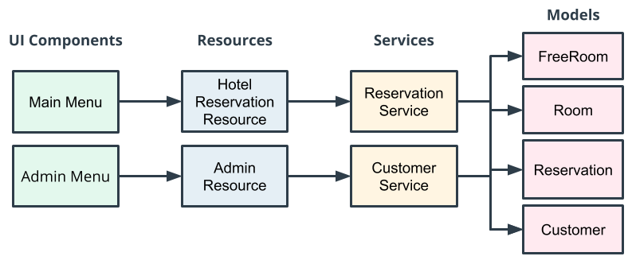

## Hotel Reservation Application

This is a Java hotel reservation application. It allows customers to find and book a hotel room based on room availability. 

This project demonstrate OOP skills, organize and process data with collections, and use common Java types.

### Architecture
The major components are a CLI for the User interface, business logic and in-memory storage. 
The architecture uses layers to support modularisation and decoupling.

